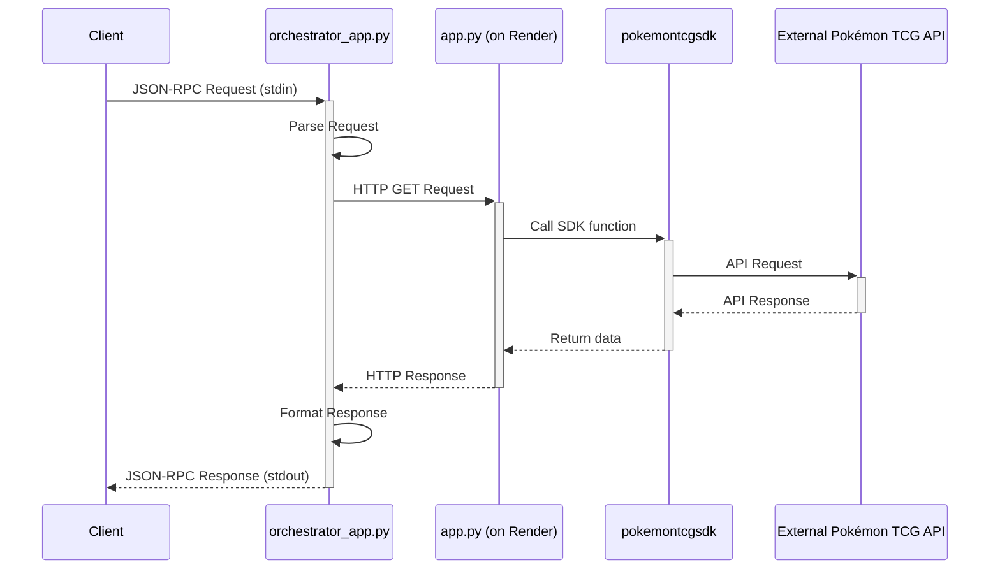

```mermaid
sequenceDiagram
    participant Client
    participant OrchestratorApp as orchestrator_app.py
    participant App as app.py (on Render)
    participant PokemonTCG_SDK as pokemontcgsdk
    participant PokemonTCG_API as External Pokémon TCG API

    Client->>+OrchestratorApp: JSON-RPC Request (stdin)
    OrchestratorApp->>OrchestratorApp: Parse Request
    OrchestratorApp->>+App: HTTP GET Request
    App->>+PokemonTCG_SDK: Call SDK function
    PokemonTCG_SDK->>+PokemonTCG_API: API Request
    PokemonTCG_API-->>-PokemonTCG_SDK: API Response
    PokemonTCG_SDK-->>-App: Return data
    App-->>-OrchestratorApp: HTTP Response
    OrchestratorApp->>OrchestratorApp: Format Response
    OrchestratorApp-->>-Client: JSON-RPC Response (stdout)
```