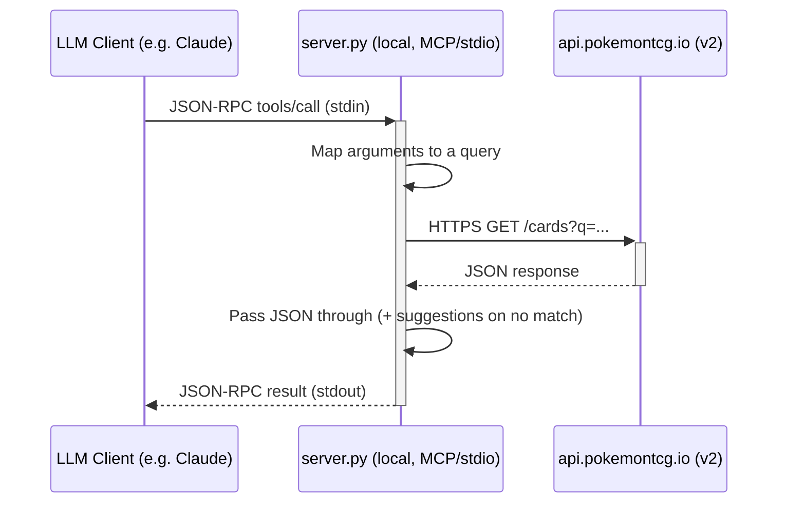

# Data Flow

The server is a single local process. The MCP client launches `server.py` over
stdio; each tool call becomes one HTTPS request to the public Pokémon TCG API,
and the JSON response is passed straight back. There is no hosted backend.

> `docs/pokemon-tcg-mcp-flow.png` is rendered from `docs/pokemon-tcg-mcp-flow.mmd`
> (the same diagram as above). To regenerate it after an edit:
> `npx -p @mermaid-js/mermaid-cli mmdc -i docs/pokemon-tcg-mcp-flow.mmd -o docs/pokemon-tcg-mcp-flow.png -b white -w 1400`
