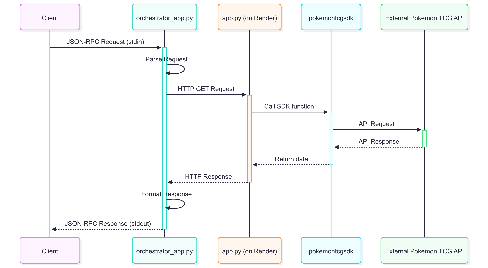

# Pokémon TCG MCP Server API Reference

This document provides a detailed reference for the Pokémon TCG MCP Server API. This API allows you to retrieve comprehensive data about Pokémon TCG cards, sets, and more.

## Base URL

All API endpoints are relative to the following base URLs:

-   **Production:** `https://pocket-monster-tcg-mcp.onrender.com/`
-   **Local Development:** `http://127.0.0.1:5000/`

---

## Data Flow Diagram



---

## Endpoints

### 1. Server Home

A simple endpoint to confirm that the server is running.

-   **Endpoint:** `/`
-   **Method:** `GET`
-   **Success Response (200 OK):**
    -   **Content-Type:** `text/plain`
    -   **Body:** A plain text welcome message.
    ```
    Pokémon TCG MCP Server is running!
    ```

---

### 2. Search for Cards

Searches for Pokémon TCG cards based on various criteria. Supports pagination.

-   **Endpoint:** `/cards`
-   **Method:** `GET`
-   **Query Parameters:**
    -   `name` (string, optional): The full or partial name of the card (e.g., `Pikachu`).
    -   `set` (string, optional): The name of the set the card belongs to (e.g., `Base`).
    -   `type` (string, optional): The card's type (e.g., `Fire`).
    -   `rarity` (string, optional): The card's rarity (e.g., `Rare Holo`).
    -   `page` (integer, optional, default: 1): The page number for results.
    -   `limit` (integer, optional, default: 20): The number of results per page.
-   **Success Response (200 OK):**
    -   **Content-Type:** `application/json`
    -   **Body:** A JSON object containing the search results and pagination info.
    ```json
    {
      "status": "success",
      "results": [
        {
          "id": "base1-4",
          "name": "Charizard",
          "...": "..."
        }
      ],
      "pagination": {
        "total_items": 1,
        "total_pages": 1,
        "current_page": 1,
        "items_per_page": 20
      }
    }
    ```
-   **Error Response (404 Not Found):**
    -   Returned when no cards match the search criteria.
    -   **Smart Error Handling:** If the search fails due to a potential typo in the `set`, `type`, `rarity`, `supertype`, or `subtype` parameters, the response may include a `suggestions` object with corrected values.
    ```json
    {
      "status": "not_found",
      "query": {
        "type": "Lighting"
      },
      "message": "No Pokémon cards found.",
      "suggestions": {
        "type": "Did you mean 'Lightning'?"
      }
    }
    ```

---

### 3. Get Card by ID

Retrieves a specific Pokémon TCG card by its unique ID.

-   **Endpoint:** `/cards/{card_id}`
-   **Method:** `GET`
-   **Path Parameters:**
    -   `card_id` (string, required): The unique ID of the card (e.g., `base1-4`).
-   **Success Response (200 OK):**
    -   **Content-Type:** `application/json`
    -   **Body:** A JSON object containing the details of the requested card.
    ```json
    {
      "status": "success",
      "card": {
        "id": "base1-4",
        "name": "Charizard",
        "...": "..."
      }
    }
    ```

---

### 4. Get Card Price

Fetches the TCGPlayer market price for a specific card by its name.

-   **Endpoint:** `/card_price`
-   **Method:** `GET`
-   **Query Parameters:**
    -   `card_name` (string, required): The full name of the card (e.g., `Charizard`).
-   **Success Response (200 OK):**
    -   **Content-Type:** `application/json`
    -   **Body:** A JSON object containing the card's name and price data.
    ```json
    {
      "status": "success",
      "card_name": "Charizard",
      "prices": {
        "holofoil": 120.50
      }
    }
    ```
-   **No Price Data Response (200 OK):**
    -   Returned when the card is found but has no available price data.
    ```json
    {
      "status": "no_price_data",
      "card_name": "Ancient Mew",
      "message": "No TCGPlayer price data available."
    }
    ```

---

### 5. Get All Sets

Retrieves a list of all Pokémon TCG sets.

-   **Endpoint:** `/sets`
-   **Method:** `GET`
-   **Success Response (200 OK):**
    -   **Content-Type:** `application/json`
    -   **Body:** A JSON object containing a list of all sets.
    ```json
    {
      "status": "success",
      "results": [
        {
          "id": "base1",
          "name": "Base Set",
          "...": "..."
        }
      ]
    }
    ```

---

### 6. Get All Card Types

Retrieves a list of all available Pokémon TCG card types.

-   **Endpoint:** `/types`
-   **Method:** `GET`
-   **Success Response (200 OK):**
    -   **Content-Type:** `application/json`
    -   **Body:** A JSON object containing a list of all types.
    ```json
    {
      "status": "success",
      "types": ["Colorless", "Darkness", "Dragon", "..."]
    }
    ```

---

### 7. Get All Card Supertypes

Retrieves a list of all available Pokémon TCG card supertypes.

-   **Endpoint:** `/supertypes`
-   **Method:** `GET`
-   **Success Response (200 OK):**
    -   **Content-Type:** `application/json`
    -   **Body:** A JSON object containing a list of all supertypes.
    ```json
    {
      "status": "success",
      "supertypes": ["Energy", "Pokémon", "Trainer"]
    }
    ```

---

### 8. Get All Card Subtypes

Retrieves a list of all available Pokémon TCG card subtypes.

-   **Endpoint:** `/subtypes`
-   **Method:** `GET`
-   **Success Response (200 OK):**
    -   **Content-Type:** `application/json`
    -   **Body:** A JSON object containing a list of all subtypes.
    ```json
    {
      "status": "success",
      "subtypes": ["Basic", "BREAK", "EX", "..."]
    }
    ```

---

### 9. Get All Card Rarities

Retrieves a list of all available Pokémon TCG card rarities.

-   **Endpoint:** `/rarities`
-   **Method:** `GET`
-   **Success Response (200 OK):**
    -   **Content-Type:** `application/json`
    -   **Body:** A JSON object containing a list of all rarities.
    ```json
    {
      "status": "success",
      "rarities": ["Common", "Uncommon", "Rare", "..."]
    }
    ```

---

### Errors

In case of an error, the API will return a JSON object with the following structure:

-   **status** (string): "error"
-   **message** (string): A human-readable error message.
-   **details** (object, optional): Additional details about the error.

**Example:**

```json
{
  "status": "error",
  "message": "Invalid request.",
  "details": {
    "reason": "The 'card_name' parameter is required."
  }
}
```
