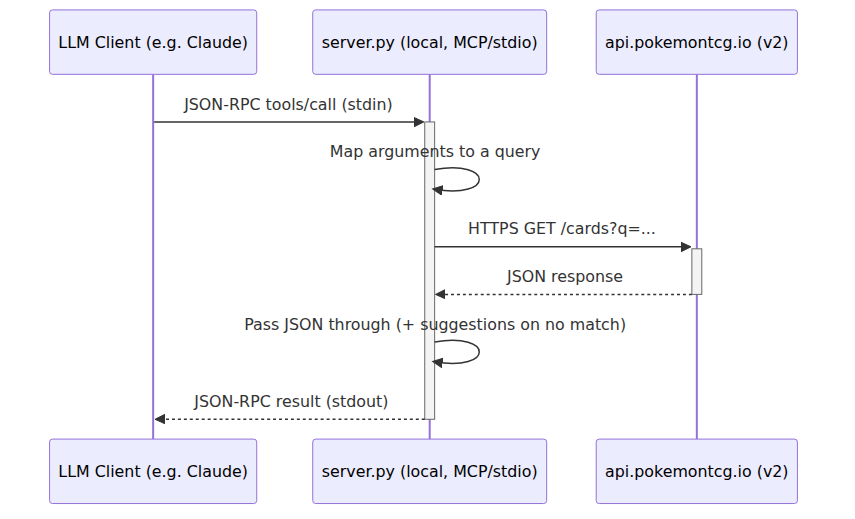

# Pokémon TCG MCP Server — Tool Reference

This server exposes the [Pokémon TCG API](https://pokemontcg.io) as Model Context
Protocol (MCP) tools. It runs as a single local process that the MCP client
launches over stdio — there are no HTTP endpoints and no hosted backend. Each
tool maps its arguments onto one request to `api.pokemontcg.io/v2` and returns
the JSON response.

Every tool returns a JSON object with a `status` field: `success`, `not_found`,
`no_price_data`, `error` (bad arguments), or `server_error` (the API was
unreachable or returned an error).

---

## Data Flow



---

## Tools

### `search_cards`

Search for cards by any combination of criteria. Supports pagination.

**Arguments**

| Name | Type | Default | Description |
| --- | --- | --- | --- |
| `name` | string | `""` | Full or partial card name, e.g. `Pikachu`. |
| `set_name` | string | `""` | Name of the set, e.g. `Base Set`. |
| `type` | string | `""` | Energy type, e.g. `Fire`. |
| `rarity` | string | `""` | Rarity, e.g. `Rare Holo`. |
| `subtype` | string | `""` | Subtype, e.g. `Stage 2`, `VMAX`. |
| `supertype` | string | `""` | `Pokémon`, `Trainer`, or `Energy`. |
| `page` | integer | `1` | 1-based page number. |
| `limit` | integer | `20` | Results per page (API caps at 250). |

**Success**

```json
{
  "status": "success",
  "results": [ { "id": "base1-4", "name": "Charizard", "...": "..." } ],
  "pagination": {
    "total_items": 1,
    "current_page": 1,
    "items_per_page": 20,
    "count": 1
  }
}
```

**Not found** — if the search matches nothing, the response may include
`suggestions` for misspelled `set_name`, `type`, `rarity`, `subtype`, or
`supertype` values:

```json
{
  "status": "not_found",
  "query": { "type": "Lighting" },
  "message": "No Pokémon cards found.",
  "suggestions": { "type": "Did you mean 'Lightning'?" }
}
```

---

### `get_card_by_id`

Get a specific card by its unique ID.

**Arguments:** `card_id` (string, required) — e.g. `base1-4`.

```json
{ "status": "success", "card": { "id": "base1-4", "name": "Charizard", "...": "..." } }
```

Returns `status: "not_found"` if no card has that ID.

---

### `get_card_price`

Get current TCGPlayer market prices for a card by name. Uses the first matching
card and returns the market price for each available print variant.

**Arguments:** `card_name` (string, required) — e.g. `Charizard`.

```json
{
  "status": "success",
  "card_name": "Charizard",
  "prices": { "holofoil": 120.50, "reverseHolofoil": 150.75 },
  "url": "https://prices.pokemontcg.io/tcgplayer/base1-4",
  "updatedAt": "2026/06/30"
}
```

Returns `status: "no_price_data"` when the card is found but has no TCGPlayer
prices, and `status: "not_found"` when no card matches the name.

---

### `search_sets`

List or search Pokémon TCG sets, with pagination.

**Arguments:** `name` (string, optional), `page` (integer, default `1`),
`limit` (integer, default `50`).

```json
{
  "status": "success",
  "results": [ { "id": "base1", "name": "Base Set", "...": "..." } ],
  "pagination": { "total_items": 1, "current_page": 1, "items_per_page": 50, "count": 1 }
}
```

---

### `get_set_by_id`

Get a specific set by its ID.

**Arguments:** `set_id` (string, required) — e.g. `base1`.

```json
{ "status": "success", "set": { "id": "base1", "name": "Base Set", "...": "..." } }
```

Returns `status: "not_found"` if no set has that ID.

---

### `get_types` · `get_supertypes` · `get_subtypes` · `get_rarities`

Each takes no arguments and returns the full list of valid values for that
category.

```json
{ "status": "success", "types": ["Colorless", "Darkness", "Dragon", "..."] }
```

```json
{ "status": "success", "supertypes": ["Energy", "Pokémon", "Trainer"] }
```

```json
{ "status": "success", "subtypes": ["Basic", "BREAK", "EX", "..."] }
```

```json
{ "status": "success", "rarities": ["Common", "Uncommon", "Rare", "..."] }
```

---

## Errors

On bad arguments a tool returns:

```json
{ "status": "error", "message": "page and limit must be positive integers." }
```

If the Pokémon TCG API is unreachable or returns an error:

```json
{ "status": "server_error", "message": "Could not reach the Pokémon TCG API: ..." }
```
